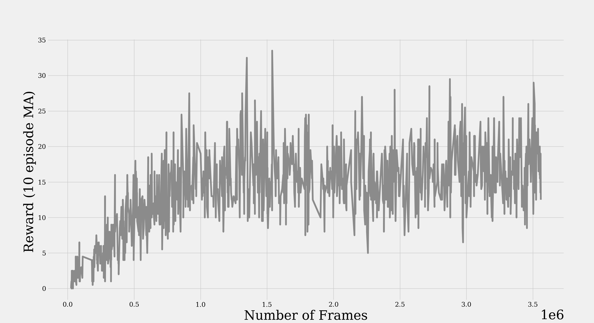

# Rainbow DQN for Open AI Gym Atari
[](LICENSE)

PyTorch implementation of [Rainbow DQN](https://arxiv.org/abs/1710.02298).
Implements [DQN](http://arxiv.org/abs/1312.5602), [DoubleDQN](http://arxiv.org/abs/1509.06461), [Dueling Networks](http://arxiv.org/abs/1511.06581), [Prioritized Replay](http://arxiv.org/abs/1511.05952), [N-Step Returns](http://www.incompleteideas.net/sutton/book/ebook/the-book.html), [Noisy Networks](https://arxiv.org/abs/1706.10295), and [Distributional DQNs](https://arxiv.org/abs/1707.06887).

## Requirements

To install necessary environment using CONDA:

```setup
conda env create --name rainbow_dqn --file=environment.yml
```

Or look at ``` environment.yml ``` for necessary packages and versions.

## Code Structure
Composed of the following five modules/scripts:

-```train.py``` loads environment, memory module, and agent, and trains model per set arguments.

-```eval.py```  loads environment, memory module, agent, and saved model, and evaluates model per set arguments.

-```environments.py``` loads and prepares gym environment. Has method ```get_env```, which can be extended for other environments and is typed to show expected return class.

-```memory.py``` loads and prepares memory. Has method ```get_module``` and informal interface class ```MemoryInterface```, which shows all required class methods typed for easy extension to new memory classes.

-```agents.py``` loads and prepares reinforcement agent. Has method ```get_agent``` and informal interface class ```AgentInterface```, which shows all required class methods typed for easy extension to new agent classes.

Ideally the modular nature allows for easy plug and play testing of different agents, memory modules, and/or environments. The DQN methods here are written all in PyTorch, however the agent interface makes no assumption of model type, allowing it to be TensorFlow, Sklearn, etc.

## Training

To train Rainbow DQN for Atari environments run:

```train
python train.py -v -at DistributionalDQN -mt PrioritizedReplay -en ENV_NAME
```
Where ```ENV_NAME``` can be any Atari environment specified in ```environments.py```. See options for training DQN, DoubleDQN, and turning on and off Dueling Networks, which can all be run independently. However if NoisyDQN or DistributionalDQN is passed, DoubleDQN and Dueling Networks are automatically used regardless of other passed arguments.
In any setting, both ```-mt StandardMemory``` and ```-mt PrioritizedReplay``` can be used to set the type of memory.
Additionally, ```-num_steps N``` can be used to set the N-step training independently with any other setting (default is ```N=3```).
For all other setting descriptions use:
```settings
python train.py --help
```
All results and models are logged in the ```runs``` directory, both as Tensorboard files and pickled dictionaries.

## Evaluation

To evaluate any model, use the same arguments in ```train.py``` to set up the agent, pass the full path to the saved model, and then set the flag ```-r``` to render the environment:

```eval
python eval.py -v -r -at DistributionalDQN -en ENV_NAME --model_path /path/to/model/model.pth
```
For all other setting descriptions use:
```settings
python eval.py --help
```
Again, the results are saved in the ```runs``` directory.


## Pre-trained Models
The full Rainbow DQN setting has been used to train models for Pong, Boxing, and Breakout. The pre-trained models can be downloaded at these links:
- [Pong](https://drive.google.com/file/d/1gVOlMdTqZWvFv2OaD4Jz-GMPkms4XCyI/view?usp=sharing)
- [Boxing](https://drive.google.com/file/d/1WwpY6MfghmszuZx0LzWfVcGR41AjDFBt/view?usp=sharing)
- [Breakout](https://drive.google.com/file/d/1jXoz3pOJM7bU-GrsIshSKWSIgyQvtrO4/view?usp=sharing)


All three can be directly run by using command in the Evaluation section -- just paste in appropriate environment name and path.

## Results
PongNoFrameskip-v4      |  Boxing-v4   |   Breakout-v4
:-------------------------:|:-------------------------:|:-------------------------:
  |   |
  |   |


## Sources
I consulted the following repositories for my implementation:

[1] https://github.com/openai/baselines/blob/master/baselines/common/atari_wrappers.py

[2] https://github.com/higgsfield/RL-Adventure

[3] https://github.com/Kaixhin/Rainbow

In particular, I directly used the environment wrappers provided by [1] and re-implemented the  code, but heavily relied on both [2] and [3] for the Prioritized Replay, Noisy Networks and Distributional DQNs.
